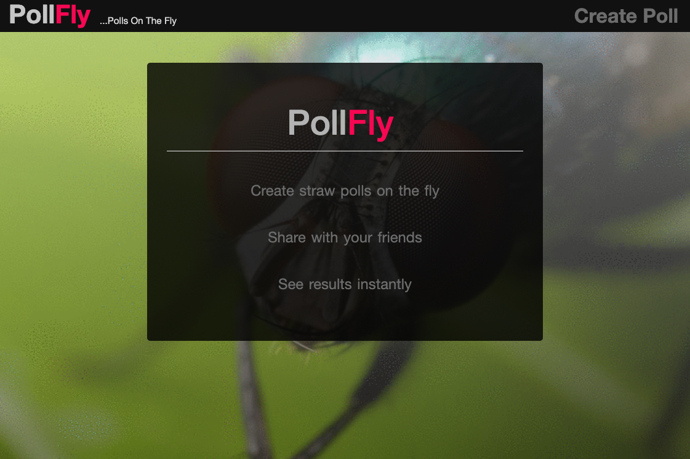

# PollFly ... Create Polls on the Fly

https://pollfly.herokuapp.com



## Running Application

### Initial setup
This project uses MongoDB. 

The follow mongodb setup commands only need to be performed on initial setup of MongoDB on your system. The following are instructions for setup for a Mac.

```
# install mongodb using brew
brew install mongodb

# create the folder where mongo will store its data
mkdir -p /usr/local/var/mongodb

# ensure this data directory has the correct permissions
sudo chown -R `id -un` /usr/local/var/mongodb

# mongodb stores its configuration file under /usr/local/etc/mongod.conf
# check this file to confirm the dbPath has been set correctly, or to get this value in the future
cat /usr/local/etc/mongod.conf

# should give output similar to this:
systemLog:
  destination: file
  path: /usr/local/var/log/mongodb/mongo.log
  logAppend: true
storage:
  dbPath: /usr/local/var/mongodb
net:
  bindIp: 127.0.0.1
```

### Run application

```
# start local mongodb instance in a shell window
mongod -dbpath /usr/local/var/mongodb

# in a different shell window navigate to the root of this repository and run the following command:
npm install

# run the application
npm start

# or to run watch on the file system:
npm run watch
```

After running the above commands you should see the application successfully run and output the localhost url and port where you can view the application running in your browser.

## Deployed Application

This application is deployed using Heroku and MongoDB Atlas.

## Future Features

"...a work is never truly completed [...] but abandoned..." Paul Valéry

Nice-to-have features:
- shortened poll url link for easier sharing
- use a data visualization library, like d3, to render cooler poll result graphs
- add testing